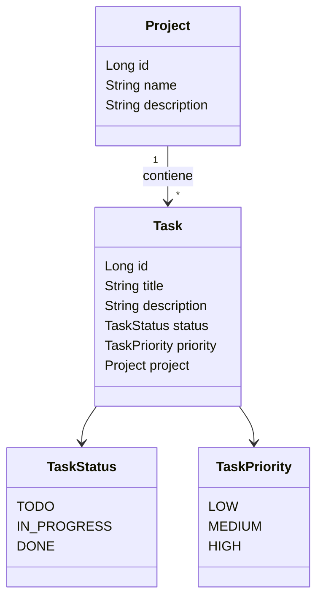
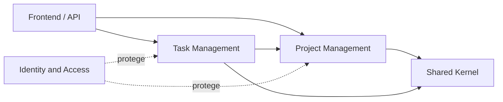
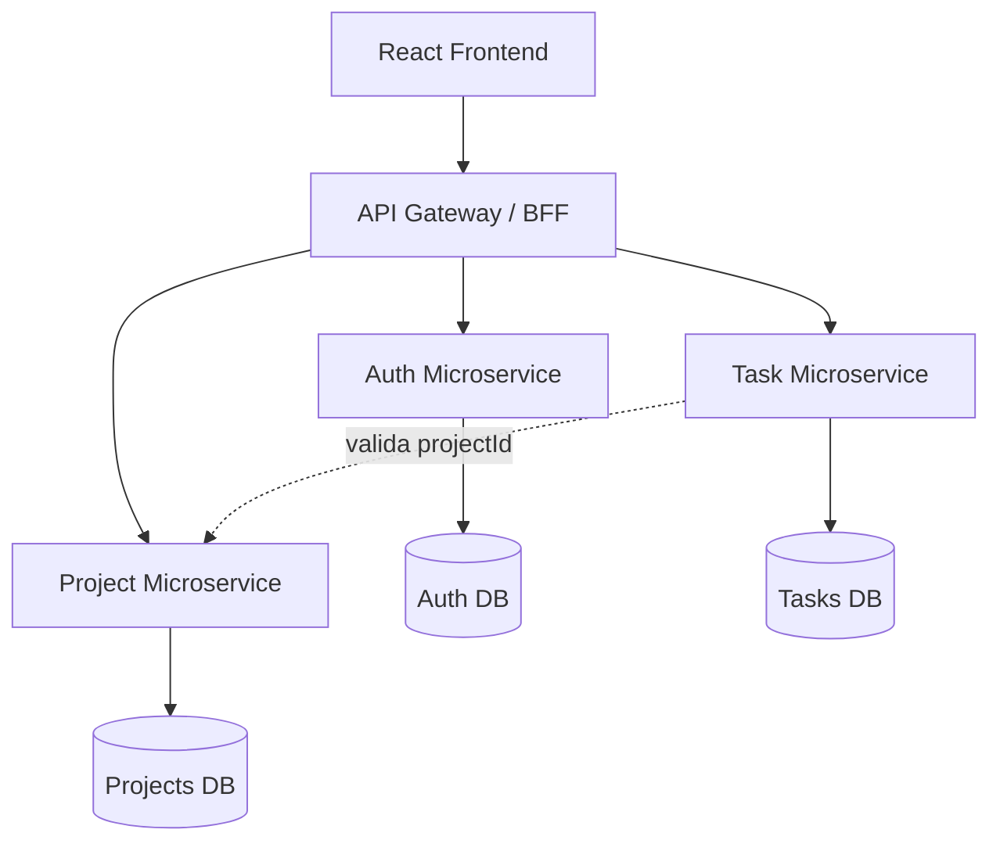
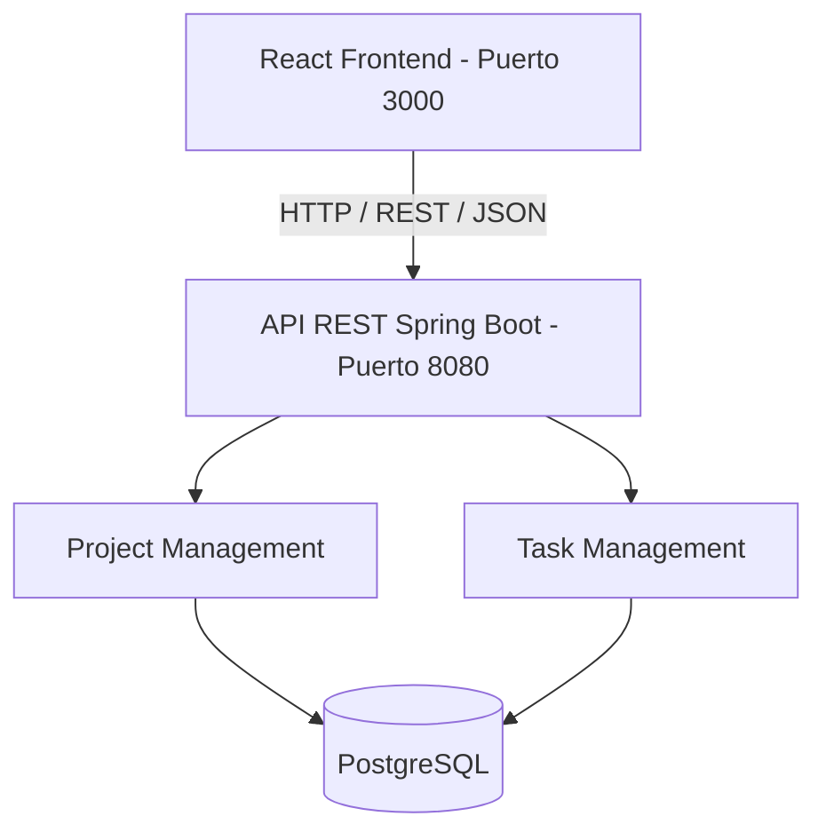

# Laboratorio 7 - Rediseño DDD del sistema Task Manager

Repositorio del proyecto final para el **Laboratorio 7 de Ingeniería de Software II**.

Este trabajo toma como base el proyecto `Laboratorio-4`, correspondiente a un sistema **Task Manager** desarrollado con **Spring Boot**, **React** y **PostgreSQL**. El objetivo principal del laboratorio fue analizar la calidad del código, identificar deuda técnica y rediseñar progresivamente la arquitectura monolítica hacia una estructura modular basada en **Domain-Driven Design (DDD)**.

---

## 1. Objetivo del laboratorio

El objetivo del Laboratorio 7 fue realizar un rediseño del sistema aplicando:

- Análisis de calidad de código con **SonarQube**.
- Revisión manual de deuda técnica.
- Identificación del lenguaje ubicuo del sistema.
- Definición del modelo de dominio general.
- Identificación de entidades, objetos de valor, agregados y relaciones.
- Rediseño de módulos principales usando DDD.
- Separación por capas: presentación, aplicación, dominio e infraestructura.
- Definición de bounded contexts.
- Propuesta de migración gradual hacia microservicios.
- Validación del desacoplamiento frontend-backend mediante API REST.

---

## 2. Integrantes y responsabilidades

| N.º | Integrante | Responsabilidad asignada | Actividad principal |
|---|---|---|---|
| 1 | Camila Andrea Mansilla Luján | Análisis SonarQube, deuda técnica, lenguaje ubicuo y análisis de dominio | Ejecutar análisis de calidad, documentar resultados, clasificar issues y relacionar la deuda técnica con DDD. |
| 2 | Marccelo Tito Lezano | Modelo de dominio general | Definir entidades principales, objetos de valor, agregados y relaciones. |
| 3 | Marcelo Juan Surco Salas | Módulo Project | Rediseñar el módulo Project con capas de presentación, aplicación, dominio e infraestructura. |
| 4 | Paola del Pilar Pumacayo Gonzales | Módulo Task | Rediseñar el módulo Task con capas de presentación, aplicación, dominio e infraestructura. |
| 5 | Ariana Failoc Castro | Bounded contexts, dependencias y microservicios | Definir bounded contexts, dependencias entre módulos y propuesta de migración a microservicios. |
| 6 | Juan Rodrigo Callo Huayna | Frontend, API REST, pruebas e integración | Desacoplar frontend-backend, validar endpoints, ejecutar pruebas y evidenciar funcionamiento. |

---

## 3. Tecnologías utilizadas

### Backend

- Java 21
- Spring Boot 3.5.3
- Maven
- Spring Web
- Spring Data JPA
- Spring Validation
- PostgreSQL
- Flyway
- JUnit 5
- Mockito
- JaCoCo
- SpringDoc OpenAPI / Swagger

### Frontend

- React
- NPM
- Axios
- React Router DOM
- PropTypes
- Testing Library
- Web Vitals

### Herramientas de calidad y gestión

- Git
- GitHub
- SonarQube
- SonarScanner
- Postman o archivos HTTP
- VS Code / IDE

---

## 4. Estructura general del proyecto

```text
Laboratorio-4
├── backend-springboot
│   ├── src
│   │   ├── main
│   │   │   ├── java
│   │   │   │   └── com.hasbi.taskmanager
│   │   │   └── resources
│   │   └── test
│   └── pom.xml
├── frontend-reactjs
│   ├── src
│   ├── public
│   └── package.json
├── functional-tests
├── docs
│   ├── LAB7.pdf
│   └── diagrams
└── README.md
```

---

## 5. Análisis de calidad con SonarQube

Se realizó el análisis de calidad del código fuente usando **SonarQube**, con el propósito de identificar problemas relacionados con:

- Reliability
- Maintainability
- Security
- Coverage
- Duplications
- Security Hotspots
- Deuda técnica

### Resultado general del análisis

| Métrica | Resultado |
|---|---|
| Quality Gate | Passed |
| Security Issues | 0 |
| Reliability Issues | 23 |
| Maintainability Issues | 25 |
| Accepted Issues | 0 |
| Coverage | 0.0% |
| Duplications | 0.0% |
| Security Hotspots | 0 |

### Interpretación

El proyecto supera el **Quality Gate**, por lo que cumple las condiciones mínimas de calidad configuradas. Sin embargo, se identificó deuda técnica principalmente en:

- Falta de validación de props en componentes React.
- Problemas de mantenibilidad en frontend.
- Cobertura reportada como `0.0%`.
- Necesidad de reorganizar el sistema por módulos de dominio.

La cobertura en `0.0%` no significa necesariamente que no existan pruebas, sino que SonarQube no importó correctamente el reporte de cobertura o que la configuración de JaCoCo todavía no se encuentra completamente integrada.

---

## 6. Revisión manual complementaria

Además del análisis automático con SonarQube, se realizó una revisión manual del código, debido a que SonarQube no detecta todos los problemas de diseño y arquitectura.

| Código | Tipo de deuda | Problema identificado | Impacto |
|---|---|---|---|
| RM-01 | Arquitectónica | El proyecto requiere una separación más clara por módulos de dominio. | Dificulta aplicar DDD de forma ordenada. |
| RM-02 | Modularidad | Se deben delimitar módulos como Project Management, Task Management y Shared Kernel. | Dificulta una futura migración a microservicios. |
| RM-03 | Dominio | El lenguaje ubicuo debe documentarse formalmente. | Puede generar ambigüedad entre términos del código y del negocio. |
| RM-04 | Pruebas | SonarQube muestra Coverage 0.0% pese a que existen pruebas ejecutadas con Maven. | No se evidencia correctamente la cobertura en el dashboard. |
| RM-05 | Frontend/API | El frontend debe comunicarse con el backend únicamente mediante API RESTful. | Afecta el desacoplamiento frontend-backend. |
| RM-06 | Módulos de dominio | Project y Task deben organizarse con límites explícitos. | Mejora mantenibilidad y prepara la migración a microservicios. |

---

## 7. Lenguaje ubicuo inicial

El lenguaje ubicuo permite establecer un vocabulario común entre el equipo, el código fuente y las funcionalidades del sistema.

| Término | Significado dentro del dominio | Uso en el proyecto |
|---|---|---|
| `Project` | Unidad de organización que agrupa tareas relacionadas con un objetivo o trabajo específico. | Entidad principal del módulo Project Management. |
| `Task` | Actividad específica que pertenece a un proyecto y puede gestionarse mediante estado y prioridad. | Entidad principal del módulo Task Management. |
| `TaskStatus` | Estado que representa el avance de una tarea dentro del flujo de trabajo. | Enum usado para valores como `TODO`, `IN_PROGRESS` y `DONE`. |
| `TaskPriority` | Nivel de prioridad asignado a una tarea. | Enum usado para clasificar tareas como `LOW`, `MEDIUM` y `HIGH`. |
| `Project Management` | Contexto encargado de gestionar el ciclo de vida de los proyectos. | Módulo responsable de crear, consultar, actualizar y eliminar proyectos. |
| `Task Management` | Contexto encargado de gestionar tareas asociadas a proyectos. | Módulo responsable de crear, consultar, actualizar y eliminar tareas. |
| `Shared Kernel` | Conjunto de elementos compartidos por varios módulos. | Puede contener excepciones, validaciones, rutas comunes y respuestas estándar. |
| `API REST` | Mecanismo de comunicación entre frontend React y backend Spring Boot. | Permite desacoplar la interfaz del usuario de la lógica del backend. |

---

## 8. Modelo de dominio general

El dominio principal del sistema es la **gestión de proyectos y tareas**.

Desde DDD, el sistema representa un dominio de planificación y seguimiento de trabajo, donde los conceptos centrales son `Project` y `Task`.

### Entidades principales

| Entidad | Descripción | Atributos principales |
|---|---|---|
| `Project` | Representa un proyecto registrado dentro del sistema. | `id`, `name`, `description` |
| `Task` | Representa una tarea asociada a un proyecto. | `id`, `title`, `description`, `status`, `priority`, `project` |

### Objetos de valor / Enums

| Elemento | Descripción | Valores |
|---|---|---|
| `TaskStatus` | Define el estado de una tarea. | `TODO`, `IN_PROGRESS`, `DONE` |
| `TaskPriority` | Define la prioridad asignada a una tarea. | `LOW`, `MEDIUM`, `HIGH` |

### Relación principal

```text
Project 1 ---- * Task
```

Un proyecto puede tener varias tareas, pero cada tarea pertenece a un único proyecto.

En el código, esta relación se evidencia mediante:

```java
@ManyToOne
@JoinColumn(name = "project_id")
private Project project;
```

### Diagrama de clases del dominio



### Agregados identificados

| Agregado | Aggregate Root | Responsabilidad |
|---|---|---|
| `Project` | `Project` | Gestionar la información principal de un proyecto y servir como referencia para sus tareas asociadas. |
| `Task` | `Task` | Gestionar la información individual de una tarea, incluyendo estado, prioridad y relación con un proyecto. |

### Servicios identificados

| Servicio | Responsabilidad |
|---|---|
| `ProjectService` | Crear, listar, buscar, actualizar y eliminar proyectos. |
| `TaskService` | Crear, listar por proyecto, buscar, actualizar y eliminar tareas. |

### Repositorios identificados

| Repositorio | Responsabilidad |
|---|---|
| `ProjectRepository` | Gestionar la persistencia de proyectos. |
| `TaskRepository` | Gestionar la persistencia de tareas. |

---

## 9. Propuesta de arquitectura modular basada en DDD

Actualmente el backend está organizado por capas técnicas:

```text
controller
dto
entity
repository
service
mapper
validator
```

Esta estructura funciona para un monolito tradicional, pero no separa completamente los módulos según el dominio del negocio.

Por ello, se propone reorganizar gradualmente el sistema en módulos de dominio:

```text
project
task
shared
```

Cada módulo puede organizarse con las siguientes capas internas:

| Capa | Responsabilidad |
|---|---|
| `presentation` | Contener controladores o puntos de entrada de la API. |
| `application` | Coordinar casos de uso y servicios de aplicación. |
| `domain` | Contener entidades, objetos de valor, reglas de negocio y servicios de dominio. |
| `infrastructure` | Gestionar persistencia, repositorios e integración técnica. |

### Estructura modular propuesta

```text
backend-springboot
└── src
    └── main
        └── java
            └── com.hasbi.taskmanager
                ├── project
                │   ├── presentation
                │   ├── application
                │   ├── domain
                │   └── infrastructure
                ├── task
                │   ├── presentation
                │   ├── application
                │   ├── domain
                │   └── infrastructure
                └── shared
                    ├── exception
                    ├── validator
                    └── response
```

---

## 10. Módulo Project

El módulo `Project` fue rediseñado siguiendo una arquitectura modular por capas.

### Responsabilidad del módulo

Gestionar el ciclo de vida de los proyectos:

- Crear proyecto.
- Listar proyectos.
- Buscar proyecto por ID.
- Actualizar proyecto.
- Eliminar proyecto.

### Capas del módulo Project

| Capa | Componentes | Responsabilidad |
|---|---|---|
| Presentación | `ProjectController` | Expone la API REST del módulo y delega la lógica al servicio de aplicación. |
| Aplicación | `ProjectService`, `ProjectServiceImpl`, `ProjectDto`, `ProjectMapper` | Orquesta casos de uso CRUD, convierte entre DTOs y entidades, y aplica validaciones. |
| Dominio | `Project`, `ProjectRepository` | Define el aggregate root y el contrato de persistencia. |
| Infraestructura | `ProjectRepositoryImpl`, `SpringDataProjectRepository` | Implementa la persistencia usando Spring Data JPA. |

### API REST del módulo Project

| Método | Ruta | Operación |
|---|---|---|
| POST | `/projects/add` | Crear proyecto |
| GET | `/projects/all` | Listar todos los proyectos |
| GET | `/projects/{id}` | Obtener proyecto por ID |
| PUT | `/projects/update/{id}` | Actualizar proyecto |
| DELETE | `/projects/delete/{id}` | Eliminar proyecto |

### Resultado del rediseño

El módulo `Project` queda alineado con DDD, separado por capas y preparado para funcionar como bounded context independiente en una futura migración.

---

## 11. Módulo Task

El módulo `Task` fue reorganizado respetando el modelo de dominio general, la relación con `Project` y los objetos de valor `TaskStatus` y `TaskPriority`.

### Responsabilidad del módulo

Gestionar tareas asociadas a proyectos:

- Crear tarea.
- Listar tareas por proyecto.
- Buscar tarea por ID.
- Actualizar tarea.
- Eliminar tarea.

### Capas del módulo Task

| Capa | Componentes | Responsabilidad |
|---|---|---|
| Presentación | `TaskController` | Expone los endpoints REST del módulo Task. |
| Aplicación | `TaskService`, `TaskServiceImpl`, `TaskRequestDTO`, `TaskResponseDTO` | Coordina casos de uso, validaciones y lógica de aplicación. |
| Dominio | `Task`, `TaskStatus`, `TaskPriority` | Representa la entidad principal y los objetos de valor del módulo. |
| Infraestructura | `TaskRepository`, `TaskMapper` | Gestiona persistencia y conversión entre entidades y DTOs. |

### API REST del módulo Task

| Método | Ruta | Operación |
|---|---|---|
| POST | `/tasks/add` | Crear una nueva tarea asociada a un proyecto |
| GET | `/tasks/project/{projectId}` | Listar tareas asociadas a un proyecto |
| GET | `/tasks/{id}` | Obtener una tarea por ID |
| PUT | `/tasks/update/{id}` | Actualizar los datos de una tarea |
| DELETE | `/tasks/delete/{id}` | Eliminar una tarea registrada |

### Resultado del rediseño

El módulo `Task` queda más limpio, mantenible y alineado con el enfoque DDD, reduciendo acoplamiento entre controlador, servicio, repositorio, mapper, DTOs y entidad.

---

## 12. Bounded Contexts

Se identificaron los siguientes bounded contexts:

| Bounded Context | Responsabilidad |
|---|---|
| `Project Management` | Gestionar el ciclo de vida de los proyectos. |
| `Task Management` | Gestionar tareas asociadas obligatoriamente a un proyecto. |
| `Shared Kernel` | Agrupar elementos compartidos como excepciones, validaciones, rutas y respuestas estándar. |
| `Identity and Access` | Contexto propuesto para autenticación, autorización, usuarios, roles y JWT. |
| `Frontend/API` | Gestionar la comunicación del usuario con el backend mediante API REST. |

### Diagrama de bounded contexts



### Dependencias entre contextos

| Contexto origen | Contexto destino | Tipo de dependencia | Justificación |
|---|---|---|---|
| `Task Management` | `Project Management` | Downstream / referencia por ID | Una tarea necesita validar que pertenece a un proyecto existente. |
| `Frontend/API` | `Project Management` | Consumo REST | La interfaz consume endpoints de proyectos. |
| `Frontend/API` | `Task Management` | Consumo REST | La interfaz consume endpoints de tareas. |
| `Project Management` | `Shared Kernel` | Dependencia compartida | Usa respuestas, excepciones o rutas comunes. |
| `Task Management` | `Shared Kernel` | Dependencia compartida | Usa validaciones, excepciones y estructuras comunes. |
| `Identity and Access` | `Project Management / Task Management` | Transversal | En una evolución futura, protegería endpoints mediante autenticación y autorización. |

---

## 13. Propuesta de migración gradual a microservicios

Se propone una migración progresiva desde el monolito actual hacia microservicios usando el patrón **Strangler Fig**.

### Estado actual

Actualmente, el backend funciona como un monolito en Spring Boot:

- Proyectos, tareas y seguridad se empaquetan juntos.
- Se utiliza una base de datos PostgreSQL compartida.
- Las validaciones entre módulos se realizan dentro del mismo backend.

### Fases de migración

| Fase | Acción |
|---|---|
| Fase 1 | Transición a monolito modular, aislando Project, Task y Shared Kernel. |
| Fase 2 | Extracción del contexto de identidad como `auth-service`. |
| Fase 3 | Extracción del dominio de tareas como `task-service`. |
| Fase 4 | Implementación de API Gateway para centralizar rutas, seguridad y tráfico. |

### Arquitectura objetivo



### Beneficios esperados

- Escalabilidad independiente.
- Mayor resiliencia.
- Despliegues más ágiles.
- Mejor separación de responsabilidades.
- Mayor mantenibilidad del sistema.

### Riesgos y desafíos

- Mayor complejidad operacional.
- Necesidad de Docker, Docker Compose o Kubernetes.
- Consistencia eventual de datos.
- Necesidad de monitoreo distribuido.
- Posible uso de patrones como Saga.

---

## 14. Frontend, API REST e integración

El frontend fue desacoplado del backend mediante una comunicación basada en **API REST**.

### Arquitectura de integración



### Archivos principales del desacoplamiento

| Archivo | Responsabilidad |
|---|---|
| `api.js` | Configura la instancia Axios y la URL base de la API. |
| `projects.js` | Define métodos de consumo API para proyectos. |
| `tasks.js` | Define métodos de consumo API para tareas. |
| `.env` | Permite configurar dinámicamente la URL del backend. |

### Endpoints REST validados

| Módulo | Método | Endpoint | Descripción |
|---|---|---|---|
| Project | GET | `/projects/all` | Obtiene la lista de proyectos. |
| Project | POST | `/projects/add` | Registra un nuevo proyecto. |
| Project | PUT | `/projects/update/{id}` | Actualiza un proyecto. |
| Project | DELETE | `/projects/delete/{id}` | Elimina un proyecto. |
| Task | GET | `/tasks/project/{projectId}` | Lista tareas vinculadas a un proyecto. |
| Task | POST | `/tasks/add` | Crea una tarea asociada a un proyecto. |
| Task | PUT | `/tasks/update/{id}` | Actualiza una tarea. |
| Task | DELETE | `/tasks/delete/{id}` | Elimina una tarea. |

---

## 15. Pruebas realizadas

### Backend

Comandos utilizados:

```bash
cd backend-springboot
mvn clean test
mvn clean install
```

Objetivo:

- Validar compilación.
- Ejecutar pruebas unitarias.
- Verificar funcionamiento del backend.
- Generar evidencias de build exitoso.

### Frontend

Comandos utilizados:

```bash
cd frontend-reactjs
npm install
npm test -- --watchAll=false
npm run build
```

Objetivo:

- Instalar dependencias.
- Ejecutar pruebas React.
- Generar build optimizado de producción.
- Verificar funcionamiento del frontend.

### Pruebas manuales

Se validó el flujo completo del sistema:

- Backend corriendo en `localhost:8080`.
- Frontend corriendo en `localhost:3000`.
- Creación de proyectos desde frontend.
- Creación de tareas desde frontend.
- Consumo de API REST desde React.
- Pruebas manuales de endpoints con Postman o archivos `.http`.

---

## 16. Comandos de instalación y ejecución

### Clonar el repositorio

```bash
git clone https://github.com/sofware-II/Laboratorio-4.git
cd Laboratorio-4
```

### Ejecutar backend

```bash
cd backend-springboot
mvn clean install
mvn spring-boot:run
```

Backend disponible en:

```text
http://localhost:8080
```

Swagger disponible en:

```text
http://localhost:8080/swagger-ui.html
```

### Ejecutar frontend

```bash
cd frontend-reactjs
npm install
npm start
```

Frontend disponible en:

```text
http://localhost:3000
```

---

## 17. Evidencias y documentación

Los entregables del laboratorio se organizan de la siguiente manera:

| Entregable | Ubicación |
|---|---|
| Informe LAB7 corregido | `docs/LAB7.pdf` |
| Diagramas DDD | `docs/diagrams` |
| Resumen del rediseño DDD | `README.md` |
| Backend Spring Boot | `backend-springboot` |
| Frontend React | `frontend-reactjs` |
| Pruebas funcionales | `functional-tests` |

### Diagramas considerados

| Diagrama | Descripción |
|---|---|
| Diagrama de clases | Representa `Project`, `Task`, `TaskStatus` y `TaskPriority`. |
| Diagrama de módulos | Muestra los módulos `project`, `task`, `shared` y `frontend/api`. |
| Diagrama de paquetes | Representa la organización por capas internas. |
| Diagrama de bounded contexts | Muestra los límites entre Project Management, Task Management, Shared Kernel e Identity and Access. |
| Diagrama de arquitectura objetivo | Representa la propuesta de migración gradual hacia microservicios. |

---

## 18. Matriz de cumplimiento del Laboratorio 7

| Punto | Requisito de la consigna | Evidencia en el trabajo | Responsable |
|---|---|---|---|
| 1 | Inspeccionar la calidad del código fuente con SonarQube. | Análisis SonarQube y dashboard de resultados. | Integrante 1 |
| 2 | Generar reporte de issues identificados por SonarQube. | Reportes Reliability y Maintainability. | Integrante 1 |
| 3 | Complementar el reporte con revisión manual. | Revisión manual complementaria. | Integrante 1 |
| 4 | Entender el lenguaje ubicuo del proyecto. | Lenguaje ubicuo inicial. | Integrante 1 / 2 |
| 5 | Identificar módulos relevantes de la aplicación monolítica. | Módulos Project, Task, Shared Kernel y Frontend/API. | Integrantes 2, 3, 4 y 5 |
| 6 | Definir el modelo de dominio de la aplicación. | Modelo de dominio general. | Integrante 2 |
| 7 | Definir contextos delimitados para los modelos. | Bounded contexts. | Integrante 5 |
| 8 | Identificar dependencias entre módulos. | Tabla de dependencias entre contextos. | Integrante 5 |
| 9 | Proponer migración gradual a microservicios. | Propuesta de migración gradual. | Integrante 5 |
| 10 | Evaluar arquitectura y aplicar arquitectura en capas. | Módulos Project y Task con capas DDD. | Integrantes 3 y 4 |
| 11 | Desacoplar frontend del backend mediante API RESTful. | Frontend, API REST, pruebas e integración. | Integrante 6 |

---

## 19. Resultado final

| Aspecto | Resultado |
|---|---|
| Calidad de código | Analizada mediante SonarQube. |
| Deuda técnica | Identificada y clasificada por Reliability, Maintainability, Coverage y revisión manual. |
| Modelo de dominio | Definido a partir de `Project`, `Task`, `TaskStatus` y `TaskPriority`. |
| Arquitectura modular | Propuesta e implementada parcialmente mediante módulos Project y Task. |
| Bounded contexts | Identificados para Project Management, Task Management, Shared Kernel e Identity and Access. |
| Frontend/API | Desacoplado mediante comunicación RESTful. |
| Proyección arquitectónica | Base preparada para una futura migración gradual a microservicios. |

---

## 20. Conclusión general

El equipo analizó la calidad del código con SonarQube, identificando deuda técnica en confiabilidad, mantenibilidad y cobertura. Con base en ello, se definió el modelo de dominio general del sistema, centrado en `Project` y `Task`.

Además, se reorganizaron los módulos principales bajo el enfoque DDD, se establecieron bounded contexts, se propuso una migración gradual hacia microservicios y se validó el desacoplamiento entre frontend y backend mediante API REST.

Como resultado, el proyecto queda preparado para evolucionar desde una arquitectura monolítica tradicional hacia una arquitectura modular más mantenible, escalable y alineada con el dominio del negocio.