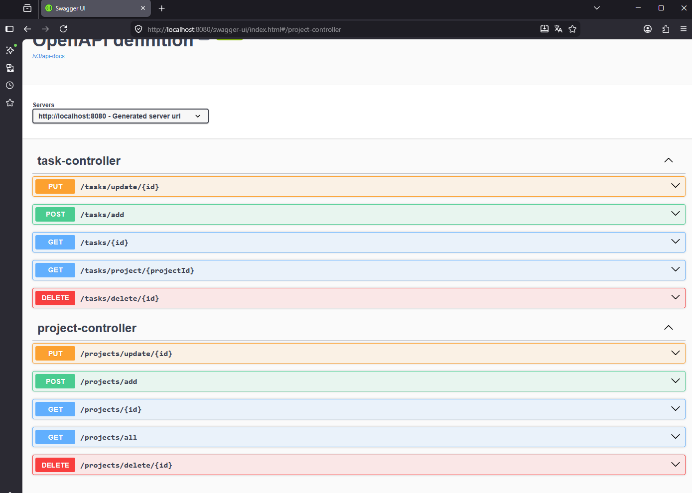
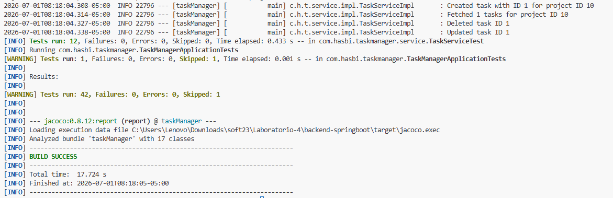
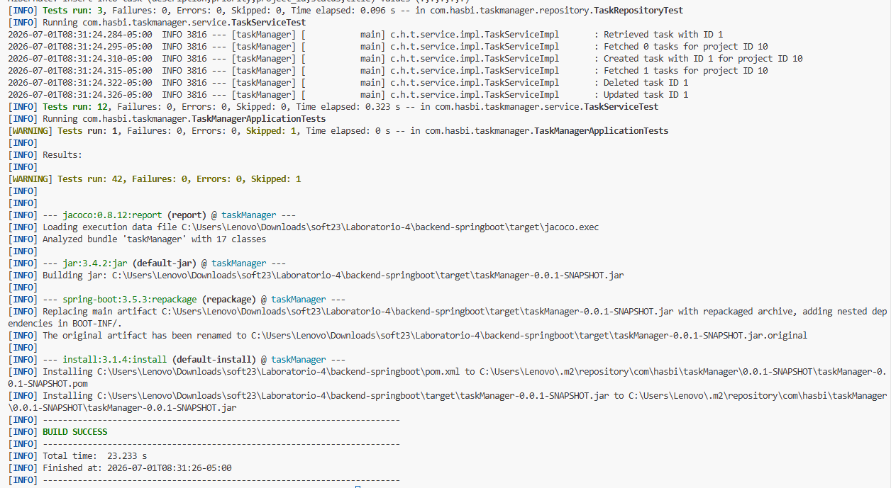

PROYECTO FINAL 
##integrante 1 
### Análisis estático con SonarQube 
Se ejecutó correctamente el análisis estático del proyecto mediante SonarScanner y se 
integró la cobertura generada por JaCoCo. Inicialmente, SonarQube reportaba una 
cobertura de `0.0%`; luego de configurar JaCoCo, la cobertura reconocida subió a `67.9%`. 
El Quality Gate quedó en estado `Failed` porque la política configurada exige una cobertura 
mínima de `80.0%` sobre código nuevo. Este resultado se documenta como hallazgo 
pendiente de mejora, ya que el análisis fue ejecutado correctamente y permitió identificar 
una deuda técnica relacionada con cobertura de pruebas. 
| Métrica | Resultado | 
|---|---| 
| SonarScanner | Ejecutado correctamente | 
| JaCoCo | Integrado | 
| Coverage | 67.9% | 
| Coverage requerida | 80.0% | 
| Quality Gate | Failed | 
| New Issues | 0 | 
| Accepted Issues | 0 | 
| Duplications | 0.0% | 
| Security Hotspots | 0 | 
## Descripción 
Se implementa el pipeline CI/CD inicial con Jenkins para el proyecto Task Manager. 
## Cambios realizados - Se agrega `Jenkinsfile`. - Se configuran etapas de checkout, verificación de herramientas, pruebas backend, build 
frontend y análisis SonarQube. - Se agregan parámetros para activar posteriormente Selenium, JMeter y Docker. - Se documentan evidencias en `docs/jenkins/`. 
## Evidencias - Pipeline ejecutado correctamente en Jenkins. - Backend validado con Maven y pruebas unitarias. - Frontend compilado correctamente. - SonarQube ejecutado correctamente. 
## Observación 
Las etapas de Selenium, JMeter y Docker quedan parametrizadas para la integración final, 
cuando las ramas de los demás integrantes sean mergeadas a `desarrollo`. 
##Integrante 2 
Se encargó de la parte correspondiente a DDD, modelo de dominio general y diagramas 
arquitectónicos del sistema Task Manager. 
Primero se revisó el dominio principal del sistema, identificando que la aplicación se centra 
en la gestión de proyectos y tareas. A partir de ello, se definieron las entidades principales 
`Project` y `Task`, junto con sus atributos más importantes. 
Luego se identificaron los objetos de valor `TaskStatus` y `TaskPriority`, los cuales permiten 
controlar los estados y prioridades válidas de una tarea. También se documentó la relación 
principal del dominio: un proyecto puede contener varias tareas, pero cada tarea pertenece 
a un único proyecto. 
Posteriormente, se propuso una organización modular basada en DDD. Los módulos 
definidos fueron `Project Management`, `Task Management`, `Shared Kernel` y 
`Frontend/API`. Esta propuesta permite separar responsabilidades y preparar el proyecto 
para una posible migración gradual hacia microservicios. 
También se elaboraron cuatro diagramas principales: - `domain-class-diagram.png`: representa las entidades `Project`, `Task`, `TaskStatus` y 
`TaskPriority`. - `modules-diagram.png`: muestra los módulos principales del sistema. - `package-diagram.png`: propone la estructura de paquetes por capas internas. - `bounded-contexts.png`: representa los contextos delimitados y sus dependencias. 
Los diagramas finales fueron colocados en `docs/diagrams`, mientras que las capturas y 
evidencias del proceso fueron organizadas en `docs/integrante-2-ddd/evidencias`. 
Finalmente, se preparó el resumen DDD para Google Docs, el cual servirá como base para 
actualizar el `README.md` principal del repositorio. 
# 3. Backend, Swagger, Endpoints y Pruebas Unitarias 
## Backend 
El backend fue desarrollado con **Java 21** y **Spring Boot 3.5.3**, implementando una 
API REST para la gestión de proyectos y tareas. 
### Tecnologías utilizadas - Java 21 - Spring Boot - Spring Data JPA - PostgreSQL - H2 Database (pruebas) - Flyway - Lombok - MapStruct - JUnit 5 - Mockito - MockMvc --- 
## Documentación con Swagger 
La API se documenta automáticamente mediante **OpenAPI (Swagger)**, permitiendo 
visualizar y probar todos los endpoints desde una interfaz web. 
### Acceso 
``` 
http://localhost:8080/swagger-ui/index.html 
``` 
### Evidencia 
 --- 
## Endpoints principales 
| Método | Endpoint | Descripción | 
|---------|----------|-------------| 
| POST | `/projects/add` | Crear un proyecto | 
| GET | `/projects/all` | Listar todos los proyectos | 
| GET | `/projects/{id}` | Obtener un proyecto por ID | 
| PUT | `/projects/update/{id}` | Actualizar un proyecto | 
| DELETE | `/projects/delete/{id}` | Eliminar un proyecto | 
| POST | `/tasks/add` | Crear una tarea | 
| GET | `/tasks/project/{id}` | Listar tareas de un proyecto | 
| GET | `/tasks/{id}` | Obtener una tarea por ID | 
| PUT | `/tasks/update/{id}` | Actualizar una tarea | 
| DELETE | `/tasks/delete/{id}` | Eliminar una tarea | --- 
## Pruebas Unitarias 
Las pruebas fueron desarrolladas utilizando **JUnit 5**, **Mockito**, **MockMvc** y **H2 
Database**, verificando el correcto funcionamiento de: - Servicios - Controladores - Repositorios - Operaciones CRUD - Manejo de excepciones 
### Ejecución de pruebas 
```powershell 
.\mvnw.cmd test 
``` 
**Resultado obtenido** - 42 pruebas ejecutadas - 0 fallos - 0 errores - 1 prueba omitida - **BUILD SUCCESS** 
### Evidencia 
 --- 
## Compilación del proyecto 
Para validar la compilación completa del sistema se ejecutó: 
```powershell 
.\mvnw.cmd clean install 
``` 
Este comando ejecuta todas las pruebas, genera el archivo ejecutable del proyecto e instala 
el artefacto en el repositorio local de Maven. 
**Resultado obtenido** - Compilación exitosa - Todos los tests aprobados - Generación del archivo `taskManager-0.0.1-SNAPSHOT.jar` - **BUILD SUCCESS** 
### Evidencia 
 --- 
## Comandos utilizados 
```powershell 
cd backend-springboot 
.\mvnw.cmd test 
.\mvnw.cmd clean install 
.\mvnw.cmd spring-boot:run 
``` 
—------------------------------------------------------------------------------------------------------------------- 
docs/testing/evidencias/ 
swagger-ui.png 
mvn-test.png 
mvn-clean-install.png 
—-------------------------------------------------------------------------------------------------------------------- 
## Integrante 4 — Pruebas Funcionales con Selenium 
Se realizaron pruebas funcionales automatizadas utilizando Selenium WebDriver con JUnit 
5, con el objetivo de validar el correcto funcionamiento del sistema Task Manager a nivel de 
interfaz de usuario (UI testing). 
Estas pruebas simulan el comportamiento de un usuario real interactuando con la aplicación 
web, verificando la integración completa entre el frontend (React), el backend (Spring Boot) 
y la base de datos (PostgreSQL). 
El enfoque principal fue garantizar que las operaciones CRUD de proyectos funcionen 
correctamente desde la interfaz gráfica, validando tanto la respuesta visual como la 
persistencia de datos en el sistema. 
## Casos de prueba validados 
Durante la ejecución de pruebas funcionales se verificaron los siguientes escenarios: 
✔ Creación de proyectos desde la interfaz web (Create Project) 
✔ Visualización del listado de proyectos en la pantalla principal 
✔ Actualización de información de proyectos existentes 
✔ Eliminación de proyectos desde la UI 
✔ Navegación entre vistas del sistema 
✔ Sincronización correcta entre frontend y backend 
## Ejecución de pruebas 
Las pruebas fueron ejecutadas desde el módulo functional-tests utilizando Maven, mediante 
el siguiente comando: 
mvn clean test 
Este proceso ejecuta los tests automatizados en un navegador Chrome controlado por 
Selenium WebDriver. 
## Resultados obtenidos 
✔ Todas las pruebas funcionales fueron ejecutadas desde el entorno de testing 
✔ Se validó la correcta comunicación entre frontend y backend 
✔ Se confirmó la persistencia de datos en la base de datos PostgreSQL 
✔ Se generaron evidencias visuales del flujo completo del sistema 
⚠ En algunos casos se presentaron tiempos de espera en elementos dinámicos (timeouts), 
propios de la sincronización UI, pero la ejecución general fue válida 
## Evidencias 
Las evidencias del proceso de pruebas funcionales se encuentran en el repositorio dentro 
de la carpeta: 
docs/testing/ 
Incluyen: 
Capturas de ejecución de mvn clean test 
Interfaz del sistema durante la creación y gestión de proyectos 
Validación del funcionamiento del backend desde la UI 
Evidencia del flujo completo de operaciones CRUD 
## Conclusión 
Las pruebas funcionales con Selenium permitieron validar el comportamiento del sistema 
desde la perspectiva del usuario final, asegurando la integración correcta entre los distintos 
componentes del sistema y confirmando que las funcionalidades principales del módulo de 
proyectos operan correctamente. 
PRUEBAS: INTEGRANTE 6 
Pruebas de rendimiento con Apache JMeter 
Se desarrolló un plan de pruebas en Apache JMeter para evaluar el rendimiento de 
los principales endpoints REST del sistema Task Manager (GET, POST, PUT y 
DELETE). Las pruebas se ejecutaron en modo no gráfico y se generó un reporte 
HTML con métricas de rendimiento como tiempo de respuesta, porcentaje de 
errores, APDEX y rendimiento (Throughput). Además, el plan de pruebas fue 
integrado con Jenkins, permitiendo su ejecución automática dentro del pipeline de 
integración continua. 
file:///C:/Users/Usuario/OneDrive/Desktop/ESTE%20ES%20SOFTWARE%20EL%20
FINAL%20FINAL/Laboratorio-4/jmeter/taskmanager-report/index.html 
Pruebas de seguridad con OWASP ZAP 
Se utilizó OWASP ZAP para realizar un análisis de seguridad sobre la aplicación 
web desplegada en el entorno local. El escaneo permitió identificar posibles 
vulnerabilidades expuestas por la aplicación, generando un reporte HTML con el 
nivel de riesgo y la descripción de cada hallazgo. En la evaluación realizada se 
detectó una vulnerabilidad de riesgo bajo correspondiente a Divulgación de errores 
de aplicación (Application Error Disclosure), lo que evidencia que el sistema expone 
información técnica cuando ocurre un error y representa una oportunidad de mejora 
en el manejo de excepciones. 
file:///C:/Users/Usuario/2026-07-01-ZAP-Report-.html 
